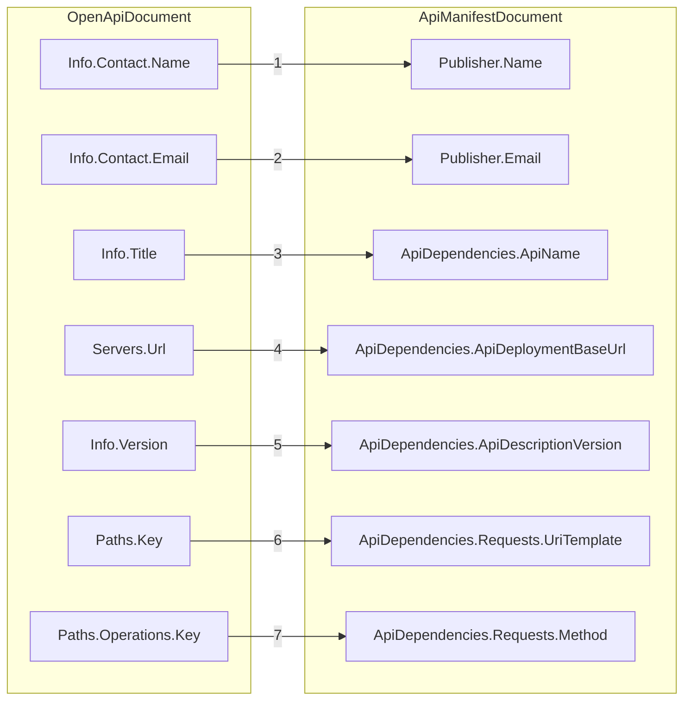

# OpenAPI to API Manifest Mapping

## Overview

This document specifies the requirements and procedures for converting an OpenAPI document to an API manifest document. An OpenAPI document is a standard format for describing the interface and operations of a web service. An API manifest is a way to store the dependencies that an application has on HTTP APIs.

## Mapping Diagram

The following diagram illustrates the mapping from the OpenAPI document to the API manifest document.

